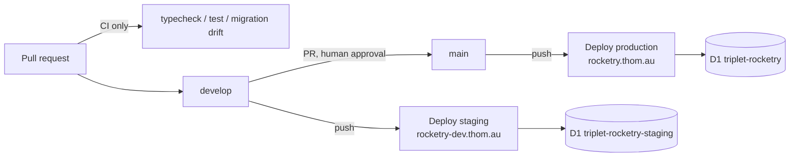

# Cloudflare Deployment

The service runs as a **Cloudflare Worker** (TypeScript + Hono) backed by
**D1**, Cloudflare's SQLite. Two branches, two isolated environments.

## Topology

| Branch | Environment | Hostname | Worker | D1 database | Config |
|---|---|---|---|---|---|
| `develop` | staging | `rocketry-dev.thom.au` | `triplet-rocketry-staging` | `triplet-rocketry-staging` | `env.staging` in `wrangler.jsonc` |
| `main` | production | `rocketry.thom.au` | `triplet-rocketry` | `triplet-rocketry` | top level of `wrangler.jsonc` |



The two environments share no state. A staging migration cannot reach
production rows, because the D1 binding `DB` resolves to a different database
in each environment (`wrangler.jsonc`).

## Why not the FastAPI stack as-is

The original WP0 service was FastAPI + SQLAlchemy(async) + asyncpg +
PostgreSQL, migrated with Alembic. That cannot run in a Worker:

- Python Workers are in open beta and do support FastAPI/ASGI, but they run
  under Pyodide, which ships **no PostgreSQL driver** — `asyncpg` is a C
  extension that opens its own TCP socket, and neither it nor `psycopg` is
  available.
- Hyperdrive, the supported route from a Worker to PostgreSQL, has JavaScript
  and Rust drivers only.
- Alembic's migration runner needs the same driver, so migrations could not run
  either.

The database layer therefore had to change no matter which language was kept.
Given the service was still a WP0 scaffold — two probe routes, nine models, two
migrations — the port to TypeScript + D1 was cheaper than any of the
alternatives (Cloudflare Containers, or a Python Worker talking to a database
over HTTP), and lands on the runtime with first-class Workers support.

## Type mapping, PostgreSQL to SQLite

D1 is SQLite, which has a narrower type system than PostgreSQL. The mapping is
declared once in `src/db/schema.ts:1` and applied mechanically:

| PostgreSQL | D1 / SQLite | Note |
|---|---|---|
| `uuid` | `text` | generated with `crypto.randomUUID()` |
| `timestamptz` | `integer` | unix milliseconds; sorts correctly, round-trips to `Date` |
| `date` | `text` | ISO `YYYY-MM-DD`; date-only values must not gain a timezone |
| `double precision` | `real` | |
| `boolean` | `integer` | 0/1 |
| `jsonb` | `text` | JSON-encoded, `mode: 'json'` |
| native `enum` | `text` + `CHECK` | SQLite has no enum type — see below |

Drizzle's `enum:` option is erased at runtime, so each enum column also carries
a `CHECK` constraint generated into `migrations/0000_init.sql`. Those
constraints are what actually enforce the domain; the TypeScript union only
catches mistakes at compile time.

## First-time setup

1. Create the databases and paste the returned ids into `wrangler.jsonc`,
   replacing `REPLACE_WITH_PRODUCTION_D1_ID` and `REPLACE_WITH_STAGING_D1_ID`:

   ```bash
   npx wrangler d1 create triplet-rocketry
   npx wrangler d1 create triplet-rocketry-staging
   ```

2. Add repository secrets `CLOUDFLARE_API_TOKEN` (scoped to *Edit Cloudflare
   Workers* plus *D1 Edit*) and `CLOUDFLARE_ACCOUNT_ID`.

3. Create the `develop` branch and set branch protection so `main` only
   advances through a reviewed pull request.

4. The `thom.au` zone must sit on the same Cloudflare account. The
   `custom_domain` routes in `wrangler.jsonc` make Wrangler create the DNS
   record and provision the edge certificate on the first deploy to each
   hostname; nothing needs adding to DNS by hand. If the zone lives on another
   account the deploy fails with a "zone not found" error, which is the signal
   to move the zone rather than to add a CNAME.

## Migrations

`src/db/schema.ts` is the source of truth; `npm run db:generate` writes a new
file into `migrations/`, which is also the directory
`wrangler d1 migrations apply` reads. CI regenerates and fails the build if the
schema and the committed migrations have drifted, so a schema change can never
merge without its migration.

Deploys apply migrations **before** uploading the Worker, and the deploy
workflow uses a non-cancelling concurrency group so two deploys to the same
target can never interleave a migration with an upload.

## Related

- [[phase1-implementation-plan]] — the WP0 scope this Worker implements.
  Cited throughout the source but not yet written; filed in [[issues]].
- `docs/legacy-fastapi.md` — how to run the retained Python reference service
