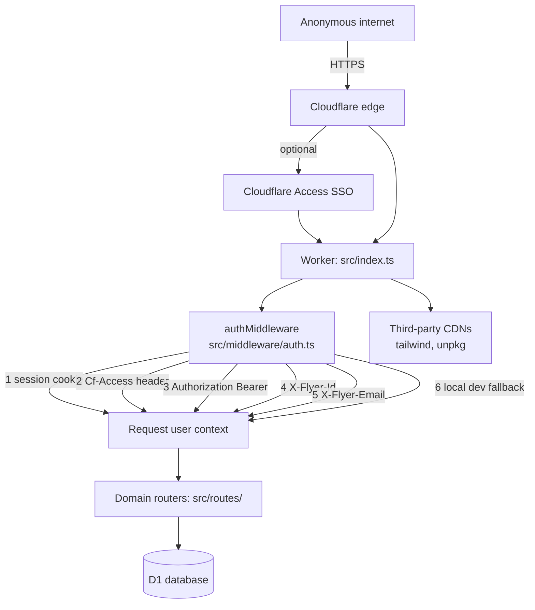

# Security Testing & Threat Model

The architectural context behind the release process in
`docs/security-testing-process.md`. The process document says *what to run and
when*; this page says *what we are defending and against whom*, and is the
input to gate G0.

Full documents:

- `docs/security-testing-process.md` — the nine release gates and the `SEC-*` suite
- `docs/security-baseline-2026-09.md` — current findings, BL-01 to BL-17
- `SECURITY.md` — vulnerability reporting policy

## What is worth protecting

| Asset | Why it matters | Where it lives |
|---|---|---|
| Member personal data | Names, emails, club affiliations | `users`, `club_memberships` |
| Certification records | A falsified level 2 or 3 lets an uncertified flyer clear a preflight gate | `certifications` |
| Propellant custody ledger | A regulatory record under South Australian explosives rules | `inventory_transactions`, storage sites |
| Authentication credentials | PBKDF2 password hashes and WebAuthn public keys | `users.password_hash`, `user_credentials` |
| Session tokens | Currently stored in plaintext — see BL-13 | `sessions.token`, `site_settings` |
| Launch site and event data | Shared club operational records | `launch_sites`, `events` |

The certification and custody records are what make this more than a hobby
application. Integrity matters at least as much as confidentiality here: a
quietly altered custody entry is a compliance failure that nobody notices.

## Trust boundaries

Boundaries the process tests, in priority order:

1. **The six identity sources in `src/middleware/auth.ts`.** Every one is a
   place an attacker can claim to be someone. Sources 4, 5 and 6 are
   development affordances that are reachable in production
   (`src/middleware/auth.ts:264-289`) — this is BL-01 and BL-12 and it is the
   single most important thing in the baseline.
2. **Role and ownership checks in `src/routes/`.** Admin gating is centralised
   at `src/routes/admin.ts:39`; per-record ownership is not centralised
   anywhere, which is why gate G4 generates an exhaustive route-by-actor
   matrix rather than trusting spot checks.
3. **The view layer.** `src/views/` relies entirely on Hono's `html` tagged
   template escaping. There is no Content-Security-Policy behind it (BL-08),
   so one mistake is a live XSS.
4. **Bulk input.** The motor CSV import (`src/services/motor_import.ts`) is
   the only untrusted-file path, and it is unbounded (BL-15).
5. **Third-party CDN scripts** loaded on every page with no Subresource
   Integrity (`src/views/layout.ts:42,71`, BL-09).
6. **Deployment configuration** — secrets, bindings, environment values,
   Access policy — which is where the highest-severity baseline findings sit
   and which no source-level test can verify. Gates G5 and G8 exist for this.

## What the architecture rules out

Recorded so the process is not padded with gates that cannot apply:

- **No container, OS or host** to scan. The Worker is a V8 isolate.
- **No filesystem or shell**, so path traversal and OS command injection have
  no reachable sink. Probed anyway by gate G6, to test the assumption.
- **No hand-built SQL.** All access goes through Drizzle's parameterised
  builder; the only `sql.raw` is a schema default at `src/db/schema.ts:168`.
  Injection stays in the test catalogue as a regression guard, not as a
  primary risk.

## Adversaries considered

| Who | Capability | Primary concern |
|---|---|---|
| Anonymous internet user | Can reach both hostnames | Authentication bypass (BL-01 to BL-04) |
| Registered club member | Holds a valid flyer account, obtainable by open self-registration (BL-17) | Reading or altering another member's records; privilege escalation |
| Compromised CDN or npm package | Executes in every authenticated browser session | Full session compromise (BL-09) |
| Someone with database read access | Backup, support export, or a future injection | Plaintext session tokens (BL-13) |

Deliberately **not** in the model: a Cloudflare platform compromise, and a
malicious maintainer. Both are outside what this project can defend against or
usefully test.

## Where this connects

- [[cloudflare-deployment]] — the branch-to-environment mapping and D1
  separation that gates G1 and G5 verify
- `TEST_INFRA.md` — the Vitest and Miniflare harness the `SEC-*` suite extends;
  the security suite reuses its opaque-box `SELF.fetch` approach rather than
  inventing a second harness

## Maintaining this page

Gate G0 requires this page to describe the system as built before each
release. Update it whenever a release adds an identity source, a trust
boundary, a data category, a route group, or an external dependency — and add
the corresponding `SEC-*` cases at the same time.
