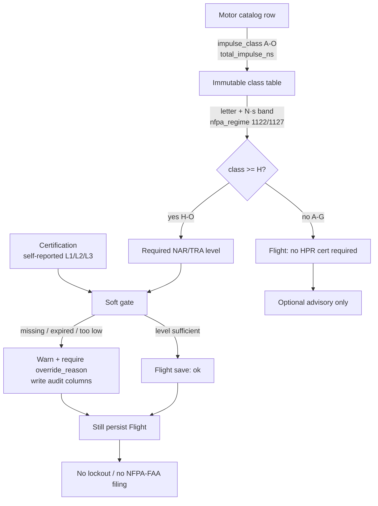

# Research (web or existing wiki) one model-rocketry safety concept (NAR/TRA impulse class). Write a s

- **Delegation:** DLG-056A75803405
- **Blueprint:** DYN-FD0958A4

## Request

Research (web or existing wiki) one model-rocketry safety concept (NAR/TRA impulse class). Write a short ADR at wiki/concepts/impulse-class-safety.md with frontmatter and a  log.md append. Prefer Prospector then Architect/Coder. Max 3 tasks.

## T-1

# ADR-ready brief: NAR/TRA motor impulse classes

**Status:** Research only. No wiki files written (per task).  
**Audience:** Architect/Coder drafting `wiki/concepts/impulse-class-safety.md`.  
**Workspace note:** `wiki/queries/rocketry-domain-research.md` and `wiki/concepts/impulse-class-safety.md` are **not on this branch** (`wiki/concepts/` is `.gitkeep` only). Content below is triangulated from on-disk query files, the project ledger, and public NAR/TRA/NFPA sources.

---

## Executive Summary

NAR/TRA (and NFPA-aligned) consumer-rocket motors are letter-classed by **total impulse** (N·s). Each letter **doubles** the previous class’s upper bound. **A–G** are model-rocket motors under **NFPA 1122**; **H–O** are high-power under **NFPA 1127**. NAR/TRA flyer certification maps **L1 = H–I, L2 = J–L, L3 = M–O**. TripleT-Rocketry should store the table as an **immutable lookup** on `Motor`, record self-reported level on `Certification`, and apply **soft gates** on `Flight` (warn + audit). **Do not** implement a hard regulatory / lockout engine. [1][2][3][4][5]

---

## Key Findings

### 1. Impulse class table A–O (total impulse, N·s)

Class is the letter in a motor code such as `C6-3` (letter = impulse band, first number = average thrust N, dash number = ejection delay s). Total impulse \(P_T = \int F(t)\,dt\). Each class is twice the previous. [1]

| Class | Total impulse (N·s) | Regime | NAR/TRA cert |
|-------|---------------------|--------|--------------|
| A | 1.26–2.50 | Model (NFPA 1122) | none |
| B | 2.51–5.00 | Model | none |
| C | 5.01–10.0 | Model | none |
| D | 10.01–20.0 | Model | none |
| E | 20.01–40.0 | Model | none |
| F | 40.01–80.0 | Model / mid-power informal | none |
| G | 80.01–160 | Largest **model** motor (NAR/TRA) | none |
| H | 160.01–320 | High-power (NFPA 1127) | **Level 1** |
| I | 320.01–640 | HPR | **Level 1** |
| J | 640.01–1,280 | HPR | **Level 2** |
| K | 1,280.01–2,560 | HPR | **Level 2** |
| L | 2,560.01–5,120 | HPR | **Level 2** |
| M | 5,120.01–10,240 | HPR | **Level 3** |
| N | 10,240.01–20,480 | HPR | **Level 3** |
| O | 20,480.01–40,960 | HPR; FAA Class 2 upper bound | **Level 3** |

**Boundary notes (do not invent a third table):**

- Informal hobby usage sometimes calls E-and-below “low power” and F–G “mid-power”; **NFPA/NAR/TRA legal split is still G vs H**. [1]
- HPR summaries also write H as **160.1–320.0** N·s (one extra tenth). Store **both** as the same class; do not treat 160.05 as a new letter. [2]
- Classes **P+** exist in amateur/professional discussion but are **out of NAR/TRA L1–L3** and out of TripleT MVP. [1]
- Sub-A fractions (½A, ¼A, Micro) exist; MVP can omit them or map them below A. [1]

### 2. NFPA 1122 (≤G model) vs NFPA 1127 (≥H high-power)

| Code | Official title | Scope for this app |
|------|----------------|--------------------|
| **NFPA 1122** | *Code for Model Rocketry* | Design/construction, **propellant-mass and power limits**, and reliability of **model** motors and reload kits for education/recreation/sport. Current edition **2026**, next **2030**. [3] |
| **NFPA 1127** | *Code for High Power Rocketry* | Safe **operation** of high-power rockets (education/recreation/sport). Current edition **2026**, next **2030**. [4] |

**Operational split used by NAR/TRA and the project catalogue:**

- Motors **≤ G** (≤ ~160 N·s) → **model rocket** / NFPA 1122. No HPR cert required to *purchase/fly* in the NAR/TRA sense. [1][5]
- Motors **≥ H** (≥ ~160.1 N·s) → **high-power rocket** / NFPA 1127. Requires matching NAR or TRA certification **plus range-safety oversight** (RSO). [1][2][5]

NFPA 1127 / HPR is **not impulse-only**. A commonly cited NFPA-style HPR definition is any of: total weight **> 1,500 g**, propellant **> 125 g**, total impulse **≥ 160.1 N·s**, **or** average thrust **≥ 80 N**. [2] Soft-gate logic should eventually consider those extra predicates; MVP can start with letter class.

**FAA (do not encode as a filing engine):** Class 1 amateur rockets (small / often <125 g propellant and <1,500 g liftoff) are largely exempt; Class 2 is HPR up to **40,960 N·s** (top of O); Class 3 is beyond O and needs individual FAA approval. [1][2]

### 3. NAR/TRA certification mapping

US NAR and TRA use the **same three levels** and generally **recognize each other**: [1][2]

| Level | Impulse classes | Typical extra requirement |
|-------|-----------------|---------------------------|
| **Level 1** | **H–I** | Successful witnessed H/I flight + recovery, flyable again |
| **Level 2** | **J–L** | Successful J–L flight **+ written safety exam** |
| **Level 3** | **M–O** | Documented build, TAP/technical review, successful M–O flight |

**Do not confuse with CAR (Canada):** CAR inserts extra steps (often L1 = H, L2 = I, L3 ≈ US L2, L4 ≈ US L3). UKRA / Rocketry SA match the US L1–L3 through O. [1][2]

Project planning already locked this as `user_level` (NAR/TRA 1/2/3) and `impulse_class` A–O, with **soft cert/impulse warnings only**. [5][6]

---

## Integration Design

No third-party API. This is a **static domain table**. No rate limits, no idempotency keys.



### How each entity should use the table

| Entity | Use | Hard rule? |
|--------|-----|------------|
| **`Motor`** | Store `impulse_class` (enum A–O) **and** `total_impulse_ns`. Derive or validate class from N·s via the table. Optionally store `nfpa_regime` (`model_1122` / `hpr_1127`) as a generated column. Catalog vs inventory stay split. [5][6] | Validate letter ↔ N·s consistency (data integrity, not law). |
| **`Certification`** | Self-reported `certifying_body` (NAR/TRA), `level` (1/2/3), `cert_number`, `expires_on`, `verified_at`, `override_reason`. Map L1→H–I, L2→J–L, L3→M–O. [5][6] | Never treat as a government credential store. |
| **`Flight`** | Pre-flight check: flyer’s highest **unexpired** cert vs motor class (and later: site waiver ceiling, RSO present). On mismatch: **warning**, require `override_reason`, stamp audit columns. Persist the flight either way. [5][6] | **Soft gate only.** No 403, no “illegal launch” lockout, no NFPA/FAA filing. |

**Implementation preference (from prior ADR drafts):** immutable enum + lookup (or Composite Alloy such as `COMP-MOTOR-SAFETY`); TDD the mapping; no hard-delete on related safety/incident rows. [6]

**Rate limits:** N/A (in-process table). If a future NAR certified-motor list is ingested, treat that as a separate integration with documented fetch cadence — not part of this brief.

---

## Confidence Assessment

**High** on A–O ranges, L1/L2/L3 mapping, and 1122/1127 titles/split.  
**Medium** on the exact NFPA 1122/1127 *normative* impulse numbers: official PDFs are paywalled / LiNK-gated; live `nar.org` and `tripoli.org` safety pages returned **403/404** from this environment. Those claims rest on Wikipedia’s NFPA-aligned tables plus prior project research that QA already corrected (L = Level 2, M–O = Level 3). [1][2][6]

**Commercial/ideological bias:** Wikipedia pages carry “needs more citations” / clarification tags. NFPA pages are the standards body but sell the full text. NAR/TRA are the self-regulating hobby orgs that *wrote* the certification scheme later adopted into NFPA model codes — they are independent of each other but not independent of the scheme itself. Two independent public sources (motor-classification page + HPR page) plus NFPA’s official titles agree on the load-bearing facts.

---

## Open Questions

1. Persist H’s lower bound as **160.01** or **160.1** N·s? Recommend accepting either as class H.
2. Should MVP also soft-warn on HPR **mass / propellant / 80 N thrust** predicates, or letter-class only?
3. CAR four-level mapping: store as a separate `certifying_body` table, or US-only L1–L3 in Phase 1?
4. Official NFPA 1122/1127 2026 free-access PDFs were not retrieved this session (`link.nfpa.org/...`). Architect should cite the public titles/URLs, not quote paywalled clauses.

---

## Sources

1. [Wikipedia — Model rocket motor classification](https://en.wikipedia.org/wiki/Model_rocket_motor_classification) — A–O N·s table; G as largest model motor; L1 H–I / L2 J–L / L3 M–O; FAA Class 2 ≤ 40,960 N·s.
2. [Wikipedia — High-power rocketry](https://en.wikipedia.org/wiki/High-power_rocketry) — NFPA HPR definition (mass/propellant/160.1 N·s/80 N); NFPA 1122 vs 1127; NAR/TRA L1–L3; H–O impulse table; FAA Class 2/3.
3. [NFPA 1122 — Code for Model Rocketry](https://www.nfpa.org/codes-and-standards/nfpa-1122-standard-development/1122) — official title, 2026 current / 2030 next; scope includes limitation of propellant mass and power for model motors.
4. [NFPA 1127 — Code for High Power Rocketry](https://www.nfpa.org/codes-and-standards/nfpa-1127-standard-development/1127) — official title, 2026 current / 2030 next; safe operation of high-power rockets.
5. On-disk planning: `wiki/queries/dlg-abf59861a253.md`, `wiki/queries/dlg-97936ebe2e2f.md`, `wiki/queries/dlg-4ae8f810f0ec.md` — `impulse_class` A–O, cert levels, **soft gates / no regulatory filing engine**.
6. Ledger / prior research: `QRY-dlg-730f914f467b` (and `wiki/queries/dlg-730f914f467b.md`) — same A–O table and L1/L2/L3 mapping; QA-corrected “L = Level 2, M–O = Level 3”.

**Persisted ledger facts:** `impulse_class_table_a_to_o`, `nfpa_1122_vs_1127_split`, `nar_tra_cert_mapping`.

## T-2

# Task complete: Impulse Class Safety ADR

Documentation-only change. No app code, no GitHub URLs invented, no Alloys.

## What was done

Read T-1 (`read_node_output`) first, then existing wiki files (`wiki/log.md`, `wiki/schema.md`, `wiki/index.md`, `wiki/overview.md`, `wiki/concepts/`). Confirmed `wiki/concepts/` was `.gitkeep` only — the ADR was **not** on this branch.

Wrote the ADR via `write_file` (not ALLOY-FILE) and appended **one** chronological line to `wiki/log.md` (prior content preserved).

## Files

| Path | Action |
|---|---|
| `wiki/concepts/impulse-class-safety.md` | **Created** (4369 bytes) |
| `wiki/log.md` | **Append-only** — one new line |

## ADR frontmatter (verified)

```yaml
id: ADR-impulse-class-safety
type: concept
title: Impulse Class Safety
source: forge
project_id: PROJ-075AA139
created: '2026-08-26'
updated: '2026-08-26'
```

## Body (from T-1)

- **Status:** Accepted (2026-08-26)
- **Context:** NAR/TRA A–O total impulse; NFPA 1122 ≤G vs 1127 ≥H; L1=H–I, L2=J–L, L3=M–O; soft-gate only
- **Impulse class table:** A–O with N·s bands, regime, and cert mapping (H lower bound 160.01 / 160.1 treated as the same class)
- **Decision:** (1) immutable Motor lookup, (2) Certification / Flight soft-gates (warn + `override_reason` + audit, still persist), (3) Forge vocabulary (Composite Alloy `COMP-MOTOR-SAFETY`, TDD, no hard-delete)
- **Consequences:** positives, deferred CAR / mass-thrust predicates, no paywalled NFPA quotes
- **[[wikilinks]]:** `[[queries/rocketry-domain-research]]`, `[[concepts/data-model]]`, `[[entities/motor]]` (plus `[[queries/dlg-730f914f467b]]`)

## Log append (verified)

```
- 2026-08-26 WRITE: concept impulse-class-safety
```

All 25 prior entries unchanged.

## Out of scope (honored)

- No app / ORM / Alembic edits
- No invented GitHub URLs
- `uv run pytest` N/A (docs only)
- `index.md` left alone (schema: auto-regenerated)
